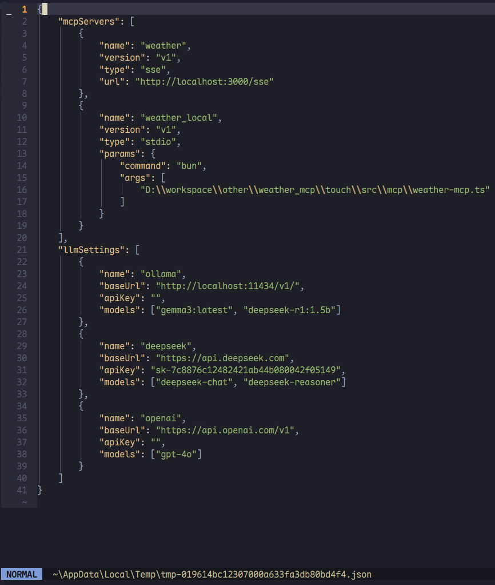

# ifcli

Chat with AI via CLI.

## Install

`ifcli` is built by [bunjs](https://bun.sh/) and requires a bun environment.

### From NPM

```bash
npm install -g @vhxnif/ifcli
```

### From Source Code

```bash
bun install && bun run build && bun link
```

## Config

**Windows:** Data and MCP configurations are stored in %APPDATA%\ifcli.

**macOS/Linux:** They are located in $HOME/.config/ifcli.

The `EDITOR` environment variable must be configured to enable configuration editing and related system functions.

## Command

```bash
Usage: ifct [options] [command]

ifcli chat with LLM

Options:
  -V, --version           output the version number
  -s, --setting           ifcli setting edit
  -h, --help              display help for command

Commands:
  new <string>            new chat
  ask [options] <string>  chat with AI
  list|ls                 list all chats
  history|hs [options]    view chat history
  remove|rm               remove chat
  switch|st               switch to another chat
  prompt|pt [options]     prompt manager
  preset|ps [options]     preset message manager
  config|cf [options]     manage chat config
  clear|cl                clear the current chat message
```

To configure various application settings using the `ifct -s` command.



**Default LLM Server Enable Rule:**
| server name | required key |
|:------------|:-------------|
| deepseek | apiKey |
| openai | apikey |
| ollama | models |

## Tips

### Chat without `ifct switch`

```bash
# the `ts` is another chat that supports translation.
alias ts = ifct ask -c 'ts'
```

### Edit System Prompt

Pipe symbols are supported

```bash
cat system_prompt.md | ifct pt -c
```

Use the editor

```bash
ifct pt -m
```

### MCP using Example

```bash
# Single Version
ifct ask "@weather What's the weather today?"

# Multi Version
ifct ask "@weather:v1 What's the weather today?"
```

### Interactive output

The `ifct cf -i` command can turn on/off interactive output.

